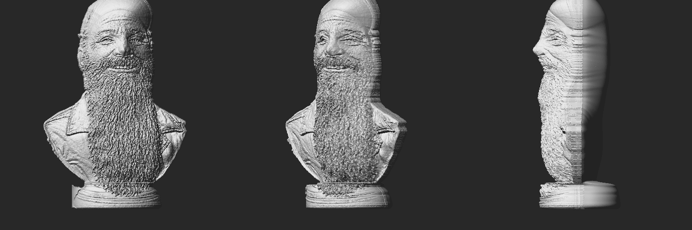

# Bearded bust – STL from a photo

`bearded_bust.stl` is a printable 3D model made from `source.png`.



| | |
|---|---|
| Size | 98 × 60 × 150 mm (W × D × H) |
| Triangles | ~500k (binary STL, ~25 MB) |
| Mesh | watertight, single body, flat base |
| Volume | ~259 cm³ solid |

## How it was made

A single photo carries no depth, so `make_stl.py` reconstructs a plausible
shape: it segments the bust from the background, inflates the silhouette into
rounded volumes (round head, flatter torso, beard layered on the chest),
revolves the pedestal into a true cylinder, sculpts the nose, eye sockets,
cheeks and cap brim, and embosses fine detail (beard strands, wrinkles, jacket
folds) from the image shading. The front is detailed; the back is a smooth
rounded guess.

## Printing tips

- Print standing on the pedestal; the solid model is heavy, so use 10–15 %
  infill or hollow it in your slicer.
- The nose and cap brim overhang – enable tree/organic supports.
- Scale freely in the slicer; the default height is 150 mm.

## Regenerate

```bash
pip install numpy scipy pillow scikit-image trimesh fast-simplification pymeshfix
python make_stl.py --height-mm 150 --faces 500000
```
