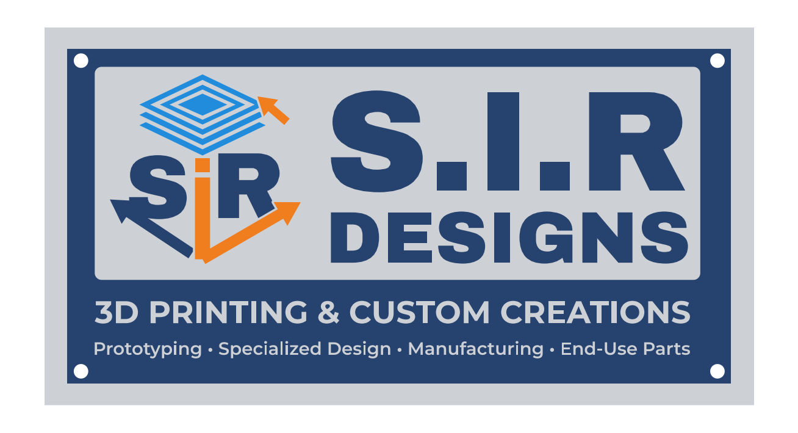

# S.I.R Designs sign – 3D printable model



A flat wall plaque of the S.I.R Designs sign, **220 × 117 × 5.6 mm**, with the
colors simplified to four filaments.

| File | Color | Contents |
|------|-------|----------|
| `sir_designs_navy.stl`   | Navy blue   | 3 mm back plate, "S.I.R", "DESIGNS", logo S + R, left arrow |
| `sir_designs_silver.stl` | Silver / light gray (or white) | Frame, name panel, both tagline lines |
| `sir_designs_blue.stl`   | Sky blue    | Stacked "layers" on top of the logo cube |
| `sir_designs_orange.stl` | Orange      | Logo "i", right arrow, corner arrow |
| `sir_designs_sign.3mf`   | all         | The four parts above in one file |
| `sir_designs_single_color.stl` | any   | Everything merged, for a one-color print |

## Printing

**Multi-color (AMS / MMU / Prusa XL, etc.)**
1. Import all four color STLs together (or open the 3MF). When the slicer
   asks, choose **"load as a single object with multiple parts"**. They all
   share one origin, so they line up automatically.
2. Give each part its filament.
3. Print flat, back side down. No supports needed.
   Suggested: 0.2 mm layers, 0.4 mm nozzle, 3 walls, 15% infill.

**Single color + filament swaps (no multi-material unit)**
The heights are stacked so you can get most of the look with color changes:
- 0–3.0 mm: navy (back plate)
- 3.0–4.0 mm: silver (panel, tagline, bottom of frame)
- 4.0–5.6 mm: navy (raised letters/logo; the frame's top edge also turns navy)

Or just print `sir_designs_single_color.stl` in one color; everything is in
relief, so it still reads well. Painting the raised parts afterwards works too.

**Mounting:** four 4.5 mm holes in the navy border fit #8 / M4 screws.

## Bambu Lab X1C (with AMS)

Download `sir_designs_x1c.zip` (the 4 color STLs plus this README).
The sign is 220 × 117 mm, so it fits the X1C's 256 × 256 mm plate.

1. Load filament into the AMS: **1 navy, 2 silver/gray (or white), 3 sky blue, 4 orange**.
   Bambu PLA Basic works: Cobalt Blue or Navy, Silver or Light Gray, Cyan/Blue, Orange.
2. In Bambu Studio choose **Bambu Lab X1 Carbon, 0.4 mm nozzle**, plate **Textured PEI**,
   process **0.20 mm Standard**.
3. Select all 4 STLs and drag them in together. When asked
   *"Load these files as a single object with multiple parts?"* click **Yes**.
4. In the Objects list, set each part's filament:
   `navy -> 1`, `silver -> 2`, `blue -> 3`, `orange -> 4`.
5. Keep the sign flat, back side down (the default). No supports and no brim needed.
6. Slice, check the preview, and print. The AMS swaps filament on every layer
   of the lettering and logo (4.0 to 5.6 mm), so expect some purge waste; turning on
   "Flush into objects' infill" in the object settings reduces it.

No AMS? Load only `sir_designs_single_color.stl`, or use the navy/silver/navy color
swaps listed above (right-click the layer slider at 3.0 mm and 4.0 mm -> *Add color change*).

## Changing the model

Edit the settings at the top of `generate.py` (overall width, layer heights,
hole size) and rerun:

```bash
pip install trimesh shapely fonttools skia-pathops mapbox_earcut matplotlib
python3 generate.py
```

Fonts are Archivo Black and Montserrat (SIL Open Font License, see `fonts/`),
chosen as close matches to the lettering on the original sign.
